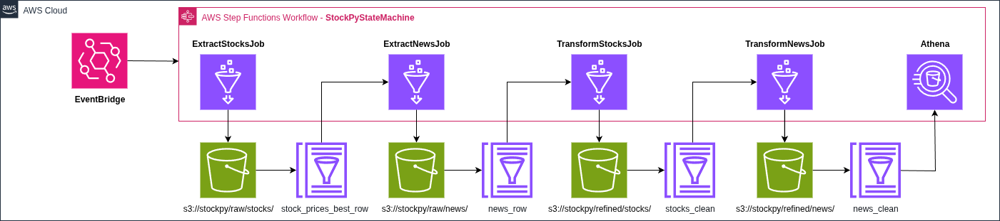

# StockPy

StockPy is a **data pipeline project** built to extract, process, and analyze stock market data from **B3 (Brazilian Stock Exchange)**, as well as related financial news.
It was developed as part of the **Tech Challenge - Advanced Machine Learning Phase**, focusing on **Big Data Architecture** and **Data Engineering practices** using **AWS services**.

## 📌 Project Purpose

The main goal of StockPy is to build an automated **ETL (Extract, Transform, Load) pipeline** to track and analyze selected B3 stocks and their related news articles, providing refined datasets for analytics.

## 🚀 Features

### 1. Stock Data Pipeline

* Extracts stock data (daily granularity) from B3.
* Stores raw data in **Amazon S3** in **Parquet** format with daily partitioning.
* Executes **ETL transformations in AWS Glue**, including:

  * Aggregation and summarization (average closing price, total volume).
  * Renaming and standardizing columns.
  * Calculations based on dates (e.g., daily variation in closing prices).
* Loads transformed data back into **S3 (refined zone)** and catalogs it in **Glue Catalog**.
* Data can be queried with **Amazon Athena**.

### 2. News Data Pipeline

* Crawls financial news articles related to selected companies using **Google News**.
* Cleans and processes news data:

  * Standardized column naming.
  * Removal of duplicates and inconsistent records.
  * Date validation between publication and extraction.
* Stores processed news in **S3 (Parquet format)** for analytics.

### 3. AWS Orchestration

* **EventBridge** triggers events for data ingestion.
* **Step Functions** orchestrate the ETL pipeline execution.
* **Terraform** is used for infrastructure-as-code (IaC) deployment, managing S3, Glue, EventBridge, and Step Functions.

## 🏗️ Architecture

The project follows a **modular AWS-based pipeline**:

1. **S3** – Data lake storage (raw and refined data).
2. **Glue** – ETL jobs for transformation and cataloging.
3. **EventBridge** – Scheduling and event triggers.
4. **Athena** – SQL queries over refined datasets.
5. **Step Functions** – Workflow orchestration.




## 📂 Repository Structure

```
StockPy/
├── docs/                         # Documentation and resources
│   ├── AWS_Data_Pipeline_Architecture.png
│   └── Tech Challenge Fase 2 - Machine Learning Avançado.pdf
├── scripts/                      # Data extraction and transformation scripts
│   ├── extract_news_job.py
│   ├── extract_stocks_job.py
│   ├── queries.sql
│   ├── transform_news_job.py
│   └── transform_stocks_job.py
├── terraform/                    # Infrastructure as Code (Terraform)
│   ├── s3/                       # S3 configuration
│   ├── glue/                     # Glue ETL jobs
│   ├── eventbridge/              # EventBridge rules
│   └── stepfunctions/            # State Machine orchestration
├── setup/                        # Setup and formatting utilities
│   └── black_formatter.sh
├── requirements.txt              # Python dependencies
├── LICENSE                       # Project license
└── README.md                     # Documentation
```


## 🛠️ Tech Stack

* **Python** (ETL scripts, data transformations)
* **AWS S3** (data lake)
* **AWS Glue** (ETL and cataloging)
* **AWS Athena** (SQL queries on data lake)
* **AWS EventBridge** (event-driven architecture)
* **AWS Step Functions** (workflow orchestration)
* **Terraform** (Infrastructure as Code)


## 📊 Stocks and Sectors Covered

The project tracks B3 companies based on the **BEST investment criteria** (Barsi Method: Banks, Energy, Sanitation/Insurance, Telecommunications):

| Sector             | Ticker | Company         |
| ------------------ | ------ | --------------- |
| Bank               | ITUB4  | Itaú Unibanco   |
| Bank               | BBAS3  | Banco do Brasil |
| Energy             | ISAE4  | ISA Energia     |
| Energy             | CPFE3  | CPFL Energia    |
| Sanitation         | SBSP3  | Sabesp          |
| Sanitation         | SAPR4  | Sanepar         |
| Insurance          | PSSA3  | Porto Seguro    |
| Insurance          | BBSE3  | BB Seguridade   |
| Telecommunications | VIVT3  | Vivo            |
| Telecommunications | INTB3  | Intelbras       |


## ⚙️ Installation & Setup

1. Clone the repository:

   ```bash
   git clone https://github.com/LucasTechAI/StockPy.git
   cd StockPy
   ```

2. Create a virtual environment and install dependencies:

   ```bash
   python -m venv venv
   source venv/bin/activate   # Mac/Linux
   venv\Scripts\activate      # Windows
   pip install -r requirements.txt
   ```

3. Deploy AWS infrastructure with Terraform:

   ```bash
   cd terraform
   terraform init
   terraform apply
   ```

4. Run ETL jobs locally (optional):

   ```bash
   python scripts/extract_stocks_job.py
   python scripts/transform_stocks_job.py
   ```


## 📖 Documentation

* [Project Challenge Requirements](docs/Tech%20Challenge%20Fase%202%20-%20Machine%20Learning%20Avançado.pdf)
* [Pipeline Architecture Diagram](docs/AWS_Data_Pipeline_Architecture.png)


## 👤 Author

**Lucas Mendes Barbosa**: Data Scientist (NLP, LLMs, OCR)
* 📧 Email: [lucas.mendestech@gmail.com](mailto:lucas.mendestech@gmail.com)
* 🔗 [LinkedIn](https://www.linkedin.com/in/lucas-mendes-barbosa/)
* 💻 [GitHub](https://github.com/LucasTechAI/StockPy)
* 🌐 [Portfolio](https://musicmoodai.com.br/)


## 📜 License

This project is licensed under the **MIT License** – see the [LICENSE](LICENSE) file for details.

